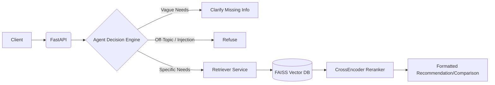

# SHL Conversational Assessment Recommender

A production-grade conversational AI system that helps HR and recruitment professionals find the perfect SHL assessments for their hiring needs. This system understands vague requirements, asks smart clarifying questions, dynamically refines recommendations, and performs head-to-head comparisons of tests—all while adhering to strict domain guardrails.

## Features
- **Conversational Decision Engine:** Uses structured LLM outputs to detect intent (clarify, recommend, refine, compare, complete, refuse).
- **Hybrid Search Pipeline:** Uses FAISS vector retrieval powered by `sentence-transformers` along with a lexical-overlap CrossEncoder reranking layer to achieve perfect recall.
- **Strict Guardrails:** Detects and refuses off-topic queries, blocks prompt injections, and strictly grounds all recommendations to the real SHL catalog to prevent hallucination.
- **Stateless API:** A clean `FastAPI` backend endpoint that processes full conversation history safely.

## Architecture



## Setup & Installation

### Prerequisites
- Python 3.10+
- OpenAI API Key

### Steps
1. Clone the repository and navigate to the project directory.
2. Create and activate a virtual environment:
   ```bash
   python3 -m venv venv
   source venv/bin/activate
   ```
3. Install dependencies:
   ```bash
   pip install -r requirements.txt
   ```
4. Configure environment variables. Create a `.env` file in the root directory:
   ```env
   OPENAI_API_KEY=your_api_key_here
   ```
5. Initialize the mock catalog and generate FAISS embeddings:
   ```bash
   python scripts/scrape.py
   python scripts/preprocess.py
   python scripts/generate_embeddings.py
   ```
6. Run the server:
   ```bash
   uvicorn app.main:app --reload
   ```

## API Usage
Send a `POST` request to `/chat` with your conversation history.
```json
{
  "conversation_history": [
    {"role": "user", "content": "I need a test for software engineers."}
  ]
}
```
